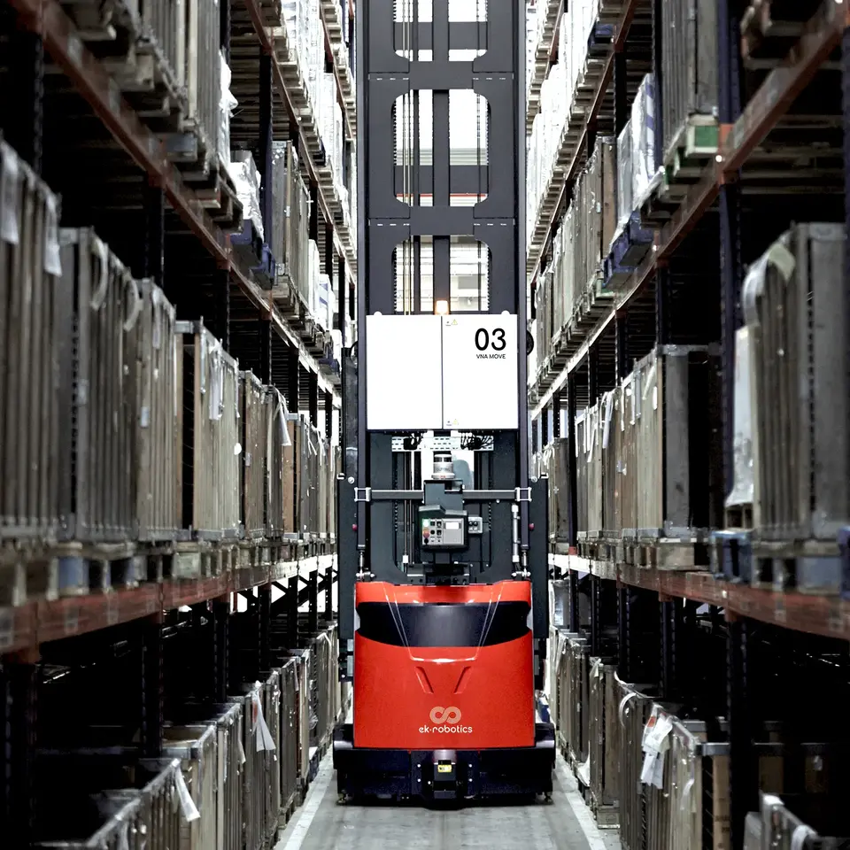

# Warehouse Robotics

## Konzept

Um festzustellen, welche Roboter benötigt werden, ist es sinnvoll, sich zunächst Gedanken zu machen, 
welche Usecases abgedeckt werden müssen. Wir können feststellen, dass die folgenden Operationen 
innerhalb unseres Systems durchgeführt können werden müssen:
- Be- und Entladung von Lastwagen
- Transport der Waren und Produkte innerhalb der Facility
- Einlagerung und Auslagerung aus einem automatischen Warehousing System
- Umstellen der Waren z.B. von einem Tisch auf den Roboter, und umgekehrt.

Wir brauchen also, aus diesen UseCases abgeleitet:
- Verladeroboter
- Transportroboter
- Ein automatisches Logistiksystem

## Verladung
Wir brauchen eine Lösung, wie gelieferte Materialien aus Lastwagen entnommen werden können, 
und fertige Produkte verladen werden können. Das könnte so aussehen:

[Boston Dynamics Stretch](https://bostondynamics.com/products/stretch/): 
Roboterarm auf fahrbarem Untersatz, der Packete mit seiner Greifvorrichtung nehmen kann.

- Kann Waren aus Lastwagen entladen oder in Lastwagen stapeln
- Das gleiche mit Regalen
- Optimal, um Produkte von den Produktionsflächen auf Roboter zu verladen 
(evtl. modifizierter Greifer notwendig)
- Preis: teuer (vermutlich)

## Transport

Die Waren müssen innerhalb der Anlage von einem Ort zum anderen kommen. Eine Flotte fahrbarer Roboter 
bietet hier mehr Flexibilität als ein Transportband und kann vom MES effizient gesteuert werden.
Beispielsweise:

[EK-Robots XMove 150](https://ek-robotics.com/en/transport-robots/x-move/): Transportroboter 
für den Halleneinsatz.
- 150kg Traglast sollten für unsere Zwecke ausreichen
- Ist durch die Ladefläche flexibel einsetzbar, und kann vom Stretch be- und entladen werden
- Ist mit 2m/s fix unterwegs
- MES kann sich um eine effiziente Steuerung kümmern

XMove ist eine Skalierbare Plattform, die Roboter gibt es auch in Varianten bis 2t Traglast. 
Das scheint aber für unseren UseCase Overkill.

## Lagerung 

Während es für automatisierte Lagerhaltung ausgefeilte Systeme gibt, übersteigen deren Kosten 
wahrscheinlich unser initialies Budget, und wären für unsere Zwecke zu mächtig. 
Stattdessen wäre es denkbar, eine normale Lagerhalle mit Regalen einzurichten und Roboter 
einzusetzen, die sich in autonom in der Lagerhalle zurechtfinden. Die gleiche Firma die auch den 
Transportroboter anbietet, bietet hierfür eine Lösung:

[EK-Robots VNA Move](https://ek-robotics.com/en/transport-robots/vna-move/#c8144): Narrow-Isle 
Lagerroboter.
- Kann bis zu einer Höhe von 14m Waren ein- und auslagern
- findet sich durch verschiedenste Sensoren auch in engen Regalhallen zurecht

Auch hier bieten die Roboter eine höhere Flexibilität als ein statisches Lagersystem. 
Die Regalfläche kann bei Bedarf erweitert werden, ebenso können weitere Roboter zugekauft werden. 
Die Anpassung an die neue Lagerfläche, bzw. die zusätzlichen Einheiten, kann dann rein in Software 
geschehen.

Feedback Lagersystem:
Palettenlager ungeeignet. Automatisiertes Kleinteilelager?  
Wie werden Die Boxen ein- und ausgepackt?  
Das sollte noch spezifiziert werden.